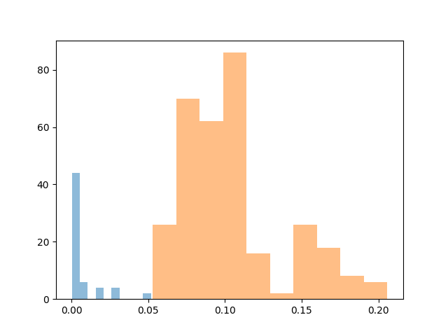

# Скрипты и зачем они нужны

    ├── augment_data.py                 <- Создание новый файлов из имеющихся
    │                                      (добавление шума или сдвига)
    ├── experiments.py                  <- Попарное сравнение файлов разными методами
    ├── experiments_with_real_noise.py  <- Тестирование финального метода
    ├── stat_tests.py                   <- Статистические тесты, проверяющие
    │                                      действенность методов


# Результаты экспериментов

Сравнивались следующие методы:

1. Хэширование записей при помощи PyDejavu, выравнивание и сравнение по пересечениям хэшей (`recording_dejavu`/`denoised_recording_dejavu`). Метод отклонен, поскольку (1) хэши чувствительны к шуму и сравнение часто дает нулевую похожесть сигналов и (2) из-за потенциальных сложностей с интеграцией и скоростью обработки (библиотека не установилась через менеджер пакетов, а для работы требует базу данных).
2. Косинусное расстояние между MFCC (`mfcc_cosine`/`denoised_mfcc_cosine`). В чистом виде метрика статистически незначима на имеющихся данных, но ее улучшенный вариант выбран оптимальным решением задачи (см. пункт 4).
3. Dynamic time warping на MFCC (`mfcc_dtw`/`denoised_mfcc_dtw`/`mfcc_split_dtw`/`denoised_mfcc_split_dtw`). Метрика статистически незначима.
4. Косинусное расстояние между MFCC после выравнивания и уменьшения частоты дискретизации (`real_noise_mfcc_cosine`). Финальная метрика.


# Статистическая значимость метрик

Результаты статистических тестов на значимость метрики для различия файлов, полученных добавлением шума и сдвигом из разных исходных и из одного. Статистически значимая разница между средними означает либо большое число нулей в данных (`dejavu`), либо рабочую на имеющихся данных метрику (`real_noise_mfcc_cosine`).

```
denoised_mfcc_cosine.csv:
0.13031422595183054 0.1217163868745168
p-value: 0.5833769816736505 (means are equal)

denoised_mfcc_dtw.csv:
0.011008349005216545 0.01235274451402164
p-value: 0.20617131720058596 (means are equal)

denoised_mfcc_split_dtw.csv:
0.023725586551004815 0.020298565273052217
p-value: 0.3504132911128903 (means are equal)

denoised_recording_dejavu.csv:
0.0037496821177490708 1.1774273269364132e-07
p-value: 0.0017905099395858245 (means are not equal)

mfcc_cosine.csv:
0.4080919605990251 0.40924538269639016
p-value: 0.9887936653638822 (means are equal)

mfcc_dtw.csv:
0.011571326434514313 0.01285296782182908
p-value: 0.24662246486894326 (means are equal)

mfcc_split_dtw.csv:
0.025183825840164768 0.02150275753570463
p-value: 0.345737117893715 (means are equal)

real_noise_mfcc_cosine.csv:
0.006793235739072164 0.10486057288944721
p-value: 3.27484428565949e-120 (means are not equal)

recording_dejavu.csv:
0.0028645673691718274 8.761078895518401e-08
p-value: 0.012866262948878833 (means are not equal)
```

График распределения значений финальной метрики (синим отмечены расстояния между схожими файлами, оранжевым — между различными):




# Финальный пайплайн сравнения

1. Выровнять второй сигнал относительно первого:
    * пройтись окном фиксированной ширины по сигналу, в каждом окне посчитать преобразование Фурье и взять частоту с максимальной амплитудой;
    * по всем возможным относительным сдвигам посчитать косинусное расстояние между массивами таких частот;
    * найти минимальное расстояние и взять сдвиг, при котором оно получено.
2. Уменьшить частоту дискретизации обоих сигналов для уменьшения погрешности выравнивания.
3. Получить из обоих сигналов MFCC.
4. Посчитать косинусное расстояние между MFCC.
5. Сравнить результат с пороговым значением.

Параметры алгоритма:

* ширина и шаг окна (предварительные значения — 1 и 0.5 секунды соответственно);
* коэффициент уменьшения частоты дискретизации (предварительное значение — 10);
* пороговое значение метрики для принятия решения о совпадении сигналов (предварительное значение — 0.06).
