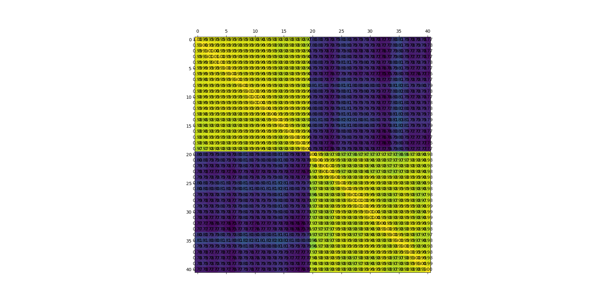

Директория содержит примеры использования библиотеки [Resemblyzer](https://github.com/resemble-ai/Resemblyzer) (эмбеддинги голосов).

Попарные похожести голосов в 30-секундных срезах из двух файлах, записанных разными людьми:

